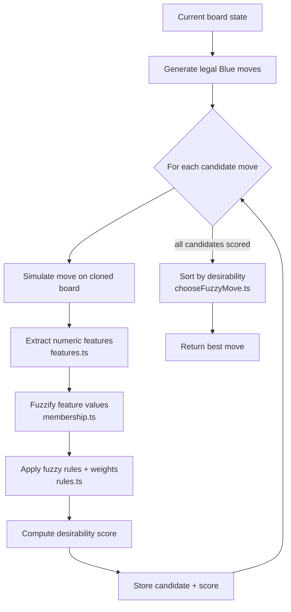
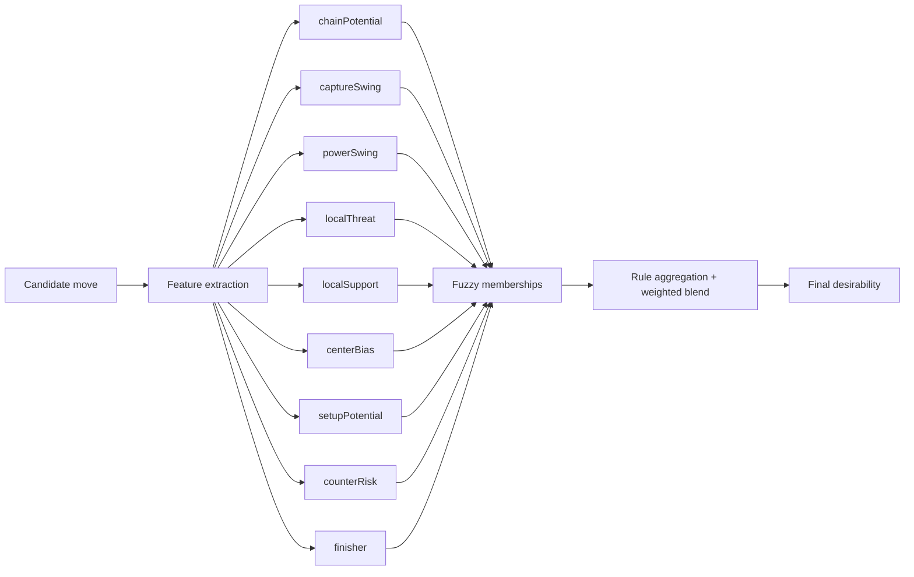

# Fuzzy Blue AI

This folder keeps the Blue player's fuzzy-logic AI separate from the React UI.

## Files

- `membership.ts`: small membership helpers such as rising, falling, and triangular curves
- `features.ts`: extracts move features from the board after simulating a move
- `rules.ts`: combines the fuzzy memberships into a final desirability score
- `chooseFuzzyMove.ts`: ranks legal moves and returns the best one

## End-to-end flow

The AI picks a move in four stages:

1. Generate legal Blue moves from the current board state.
2. Simulate each move and extract tactical features in `features.ts`.
3. Convert feature values into fuzzy memberships, then combine them into a single desirability score in `rules.ts`.
4. Rank all candidates in `chooseFuzzyMove.ts` and return the highest-scoring move.

## Per-move scoring flow

Each candidate move is scored independently using this logic:

## Current feature set

Each Blue move is evaluated with these inputs:

- `chainPotential`: how many explosions the move creates
- `captureSwing`: how many cells Blue gains while Red loses cells
- `powerSwing`: how much Blue's total power increases
- `localThreat`: nearby Red pressure around the target cell
- `localSupport`: nearby Blue support after the move
- `centerBias`: whether the move helps control the center
- `setupPotential`: how many Blue cells are left charged and ready to threaten explosions
- `counterRisk`: how strong Red's best reply looks after Blue commits
- `finisher`: whether the move can immediately eliminate Red

## Practical reading order

If you want to understand the behavior quickly, read files in this order:

1. `chooseFuzzyMove.ts` (top-level loop and selection)
2. `features.ts` (what gets measured)
3. `rules.ts` (how measurements become decisions)
4. `membership.ts` (shape of each fuzzy curve)

## How to tune it

1. Open `rules.ts`
2. Adjust the thresholds inside the membership calls
3. Adjust the weights in the final `desirability` formula
4. Rebuild and play a few rounds

Start by changing only one threshold or weight at a time so the behavior stays easy to understand.
